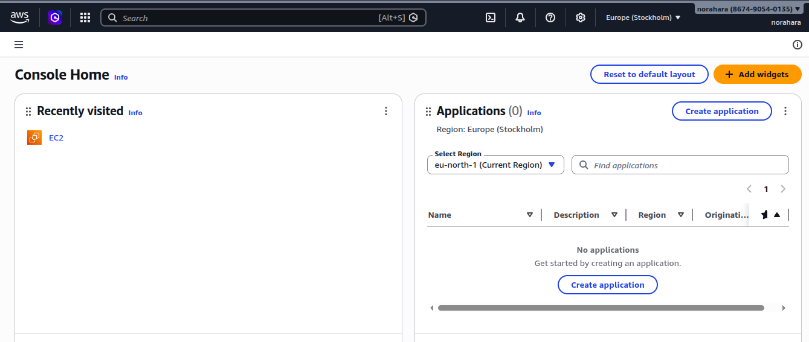
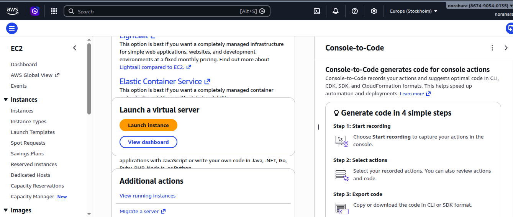
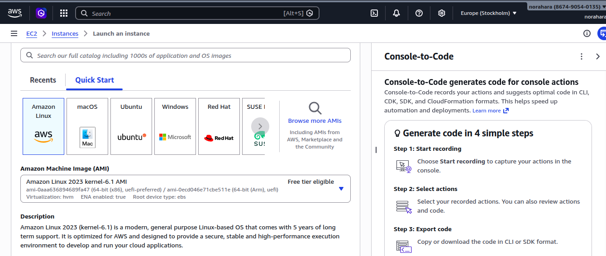
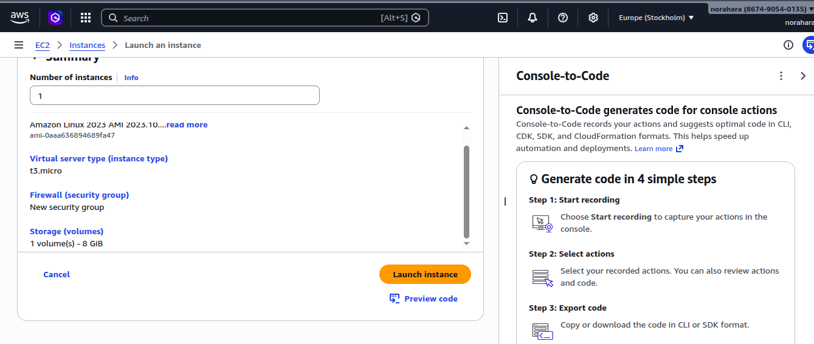
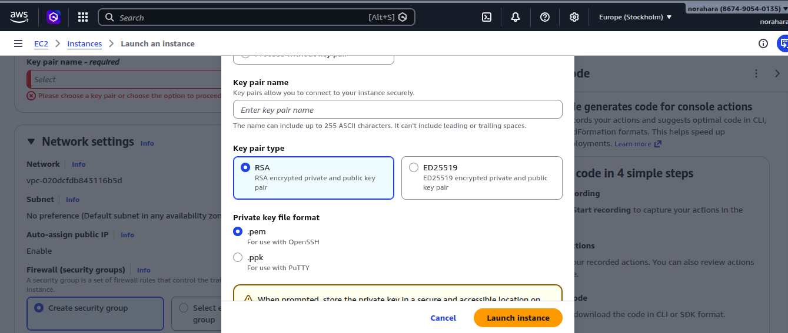
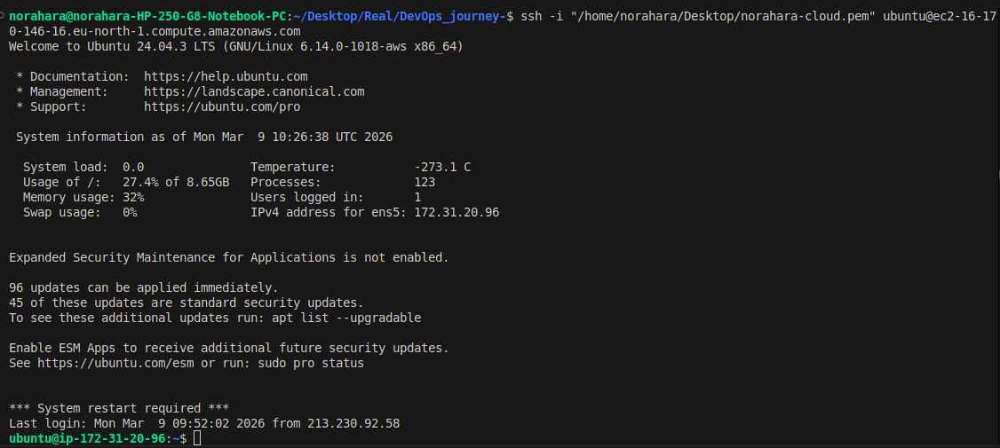

## Amazonda EC2 serverini olib botni ishga tushurish

- amazondan server olish
    
    ``` 
    https://aws.amazon.com/free/ shu sayt orqali ro`yxatdan o`tish

    ```

- ro'yxatdan o`tgandan kiyin

   

- EC2 ni ishga tushirish uchun 

   
    
    > Lunch Instance

    tugmasi bosiladi

- Quyida Ubuntu tanlanadi 

   
   


      > Lunch Instance

        tugmasi bosiladi

- Key-pair yaratiladi 


   

    > Agar linux ishlatilsa shaxshiy konpyuterda .pem formatda windows bo`lsa ikkinch format tanlanib tugma bosiladi browser aftomaptik fayl yuklab oladi faylga 


```
chmod 400 fayl_nomi.pem

```


serverga ulanish uchun 

```
ssh -i "fayl-nomi.pem" ubuntu@dns-nomi

```
   
