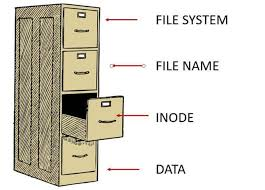
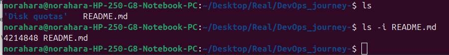
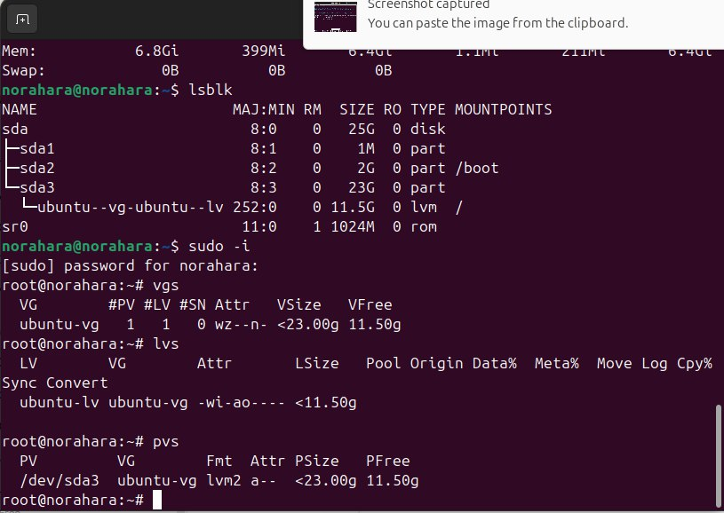
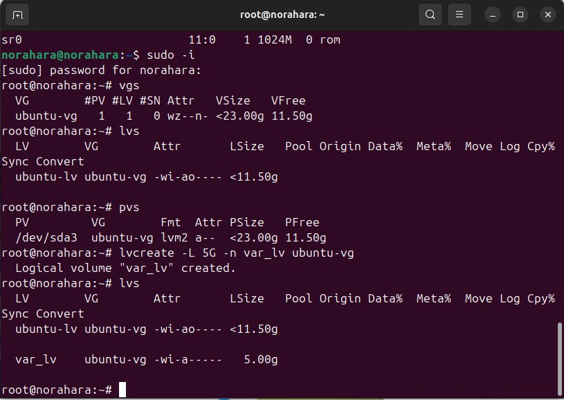
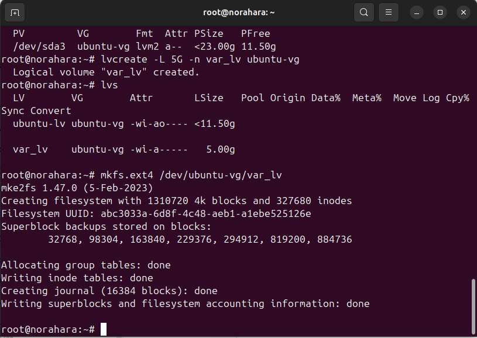
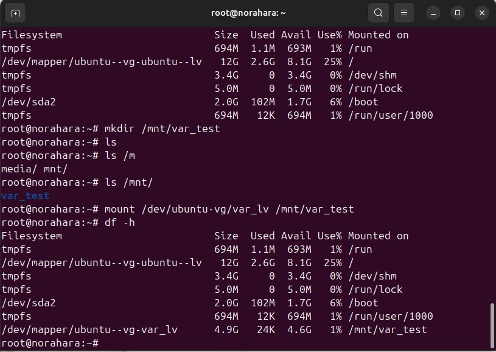

## Disk quota - nazariy va amaliy 

### < Nazariy qism />

- Disk quota nima? 💿

> Disk quotasi bu foydalanuvchilar yoki guruhlar uchun diskdan foydalanish cheklovini qo`yadi nimaga kerak deyilganda bular serverlarni bir foydalanuvchi tomonida to'ldirib tashlashni oldini olib server qulash xavfini kamaytiradi 
misol uchun serverda 10 GB joy bor agar disk quotalanmasa bir foydalanuvchi uni to'ldirib qo'yishi va server ishdan chiqishi mumkin

- Disk quotasi nimani va qanday cheklaydi deyilgan savol javobi quyidagicha:

  Disk quota odatda 2 xil resursni cheklaydi:
  
  1. Block quota (disk hajmi)
  2. Inode quota (fayllar soni) 

  Inode — bu fayl haqidagi ma’lumotlar pasporti 📄
Faylning o‘zi EMAS, balki uning tavsifi.
  Inode nimalarni saqlaydi?

    1. Fayl hajmi

    2. Egasini (owner)

    3. Ruxsatlari (permissions)

    4. Yaratilgan / o‘zgartirilgan vaqti

    5. Diskda qayerda joylashgani (qaysi blocklarda)

   

  Inode tartib raqami (har bitta fayl bitta inode)

   

  2️⃣ Disk block nima?

    Disk block — bu diskdagi real joy, fayl ma’lumoti saqlanadigan qism 📦

     Fayl ma’lumotlari (text, video, rasm) shu yerda yotadi

        O‘lchami odatda:

                4KB

                8KB
                
    Muommo chiqaruvchi vaziyat shundaki Inode yoki Blockning ikklasidan bittasi tugashi ham xotirada joy qolmaganlik xatosini chiqaradi

### < Amaliy qism />

    - Disk quotalarini sozlash

Disk quotalarini o`rnatish uchun /etc/fstab fayliga o'zgartirish va qo'shimchalar qo'shiladi Undan oldin bir nechta amallar bajarilishi kerak 

  Men bu o`rganishim davomida quyidagi vazifalarni bajardim bular:
  - logic volume lar bilan ishlash
  - file systemni disklarga ajratish
  - /var /home kabi fayllarni alohida disklarga ajratish
  - disk quotalarni tayinlash 
  - userlarga diskdan foydalanish uchun cheklov o`rnatish

  filesystem ni o`rganish jarayoni shularni tajriba qilib ko'rdim

### logic volume lar bilan ishlash
  - Diskni tekshirish

   

  - /var katalogi uchun 5g disk ajratish quyidagi buyruq orqali

  > lvcreate -L 5G -n var_lv ubuntu-vg

   

  - filesystem  berish uchun: 
  > mkfs.ext4 /dev/ubuntu-vg/var_lv

  

  - yangi diskni vaqtinchalik katalogga mount qilish bu /var katalogini ustiga yozilib ma'lumotlar o'chib ketishini oldini oladi.

   
